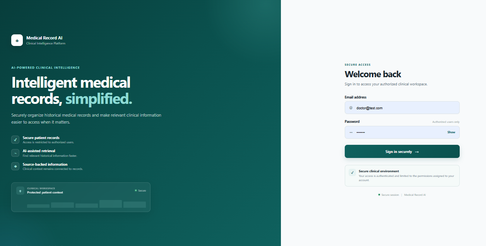
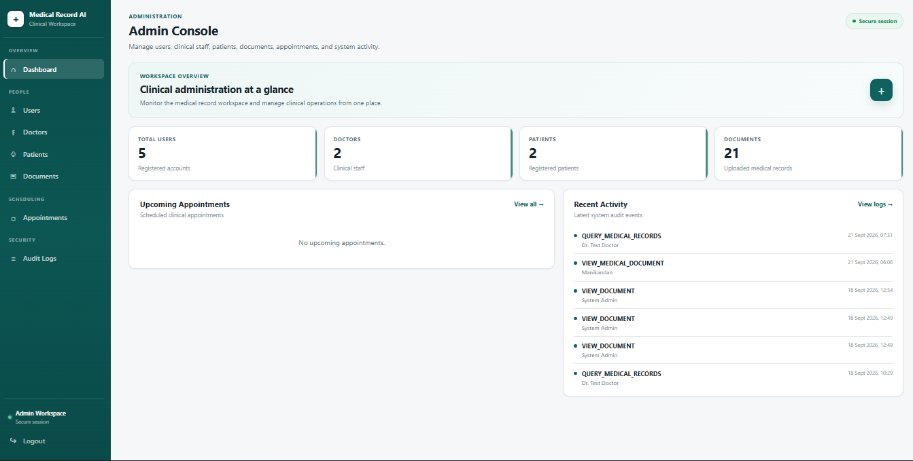
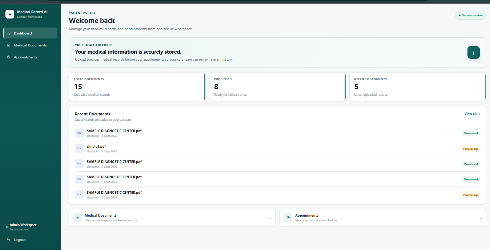
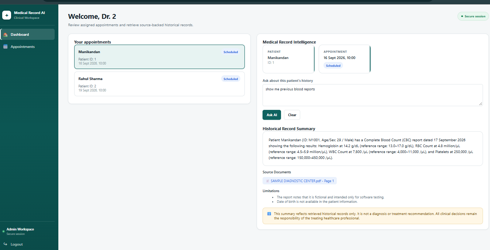
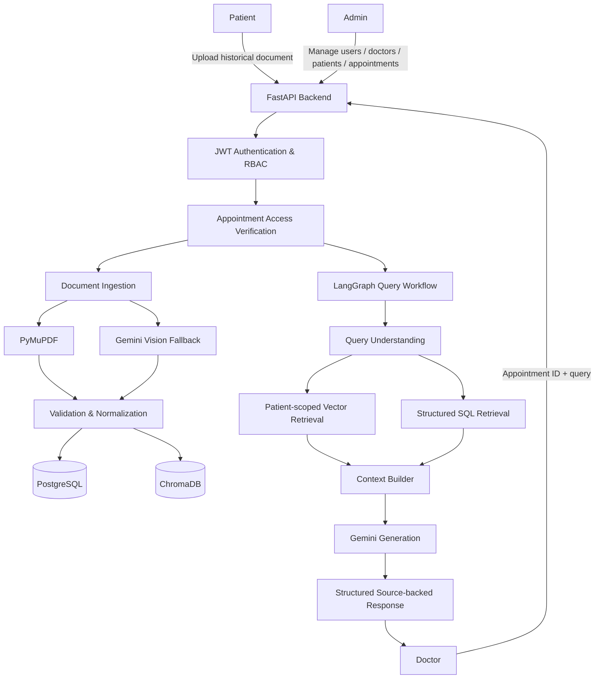
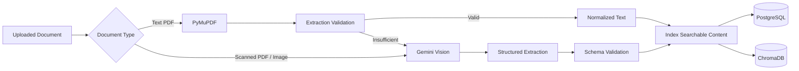

# MedicalRecordAI

> AI-powered Medical Record Intelligence System for secure, appointment-scoped retrieval and summarization of historical medical records.

MedicalRecordAI is a full-stack clinical workspace that helps doctors quickly retrieve relevant information from a patient's historical medical records before or during an appointment.

Patients upload historical medical documents. Administrators manage users, doctors, patients, documents, appointments, and audit activity. During an appointment, an authorized doctor can ask a natural-language question about the patient's history. The backend verifies the doctor's appointment access, retrieves patient-scoped information from PostgreSQL and ChromaDB, and uses a LangGraph workflow to generate a source-backed historical summary.

> **Important:** MedicalRecordAI is an information-retrieval and summarization system. It does not diagnose conditions, prescribe treatment, or replace professional clinical judgment.

## 📑 Table of Contents

- [Overview](#-overview)
- [Key Features](#-key-features)
- [Application Screenshots](#-application-screenshots)
- [System Architecture](#-system-architecture)
- [Core Workflow](#-core-workflow)
- [User Roles](#-user-roles)
- [AI and RAG Pipeline](#-ai-and-rag-pipeline)
- [Document Ingestion Pipeline](#-document-ingestion-pipeline)
- [Security and Access Control](#-security-and-access-control)
- [Tech Stack](#-tech-stack)
- [Project Structure](#-project-structure)
- [Getting Started](#-getting-started)
- [Environment Configuration](#-environment-configuration)
- [Running the Application](#-running-the-application)
- [API Endpoints](#-api-endpoints)
- [Example Doctor Query](#-example-doctor-query)
- [Design Decisions](#-design-decisions)
- [Limitations](#-limitations)
- [Future Improvements](#-future-improvements)
- [Disclaimer](#-disclaimer)

## 🩺 Overview

The system addresses the problem of reviewing historical medical records spread across multiple documents.

The core workflow is:

```text
Patient
  │
  ├── Upload historical medical documents
  └── View documents and appointments
           │
           ▼
     MedicalRecordAI
           │
     ┌─────┼────────┐
     ▼     ▼        ▼
   Admin Ingestion Doctor
                    │
                    └── Appointment-scoped query
                              │
                              ▼
                    PostgreSQL + ChromaDB
                              │
                              ▼
                         LangGraph
                              │
                              ▼
                    Source-backed summary
```

The central authorization principle is:

```text
Doctor → Appointment → Verified Patient → Patient-scoped Retrieval
```

The client does not choose the patient ID for medical-record retrieval.

## ✨ Key Features

### 🔐 Authentication & Authorization
- JWT-based authentication
- Patient, Doctor and Admin roles
- Protected frontend routes
- Backend role checks
- Appointment ownership verification
- Patient-scoped retrieval

### 👤 Patient Workspace
- Upload historical medical documents
- View uploaded records
- View appointments
- Track document processing status
- Open uploaded documents

### 👨‍⚕️ Doctor Workspace
- View assigned appointments
- Select an appointment
- Ask natural-language questions
- Retrieve relevant historical records
- Receive source-backed summaries
- View source documents/pages
- View response limitations

### 🛠️ Admin Console
- Manage users
- Create/view doctors
- Create/view patients
- Create/view appointments
- View documents
- View audit logs

### 🤖 AI / RAG
- Query understanding
- ChromaDB semantic retrieval
- PostgreSQL structured retrieval
- LangGraph orchestration
- Gemini-based extraction/generation
- Structured response validation
- Source-aware generation

### 📄 Document Intelligence
- PyMuPDF extraction for text PDFs
- Extraction-quality validation
- Gemini vision fallback for scanned/image documents
- Medical record normalization
- Structured measurement extraction
- ChromaDB indexing

## 📸 Application Screenshots

### 🔐 Login



### 👤 Patient Dashboard



### 🛠️ Admin Console



### 👨‍⚕️ Doctor Dashboard



## 🏗️ System Architecture



## 🔄 Core Workflow

### 1. Patient uploads a historical document

```text
Upload
  ↓
Document type detection
  ↓
Text PDF or scanned/image document
```

### 2. Document extraction

Text PDF:

```text
PDF → PyMuPDF → Text → Validation
```

Scanned/image:

```text
PDF/Image → Gemini Vision → Structured Medical Information
```

### 3. Storage

```text
Normalized Medical Record
       │
       ├── PostgreSQL → structured data
       │
       └── ChromaDB → searchable medical text
```

### 4. Doctor query

```text
Doctor JWT
   ↓
Doctor profile
   ↓
Appointment ownership verification
   ↓
Patient ID derived from appointment
   ↓
LangGraph
   ├── Query Understanding
   ├── Vector Retrieval
   ├── SQL Retrieval
   ├── Context Builder
   └── Generation
   ↓
Source-backed historical summary
```

## 👥 User Roles

### Patient

```text
Login
 ├── Dashboard
 ├── Medical Documents
 └── Appointments
```

Patients upload historical records and manage their own documents.

### Doctor

```text
Login
 ├── Dashboard
 ├── Assigned Appointments
 └── Medical Record Intelligence
       └── Natural-language query
```

Doctors query historical information for appointments assigned to them.

### Admin

```text
Login
 ├── Users
 ├── Doctors
 ├── Patients
 ├── Documents
 ├── Appointments
 └── Audit Logs
```

## 🧠 AI and RAG Pipeline

The query workflow is implemented as an explicit LangGraph pipeline:

```text
START
  ↓
Query Understanding
  ↓
Vector Retrieval
  ↓
SQL Retrieval
  ↓
Context Builder
  ↓
Generation
  ↓
END
```

The response is structured around:

```text
patient_id
summary
sources
limitations
```

### Hybrid retrieval

**ChromaDB** handles semantic search over searchable historical record content.

**PostgreSQL** handles structured medical information and metadata such as:

- Patients
- Doctors
- Appointments
- Documents
- Medical records
- Measurements
- Audit logs

The retrieved information is combined before generation.

## 📄 Document Ingestion Pipeline



The extraction layer checks whether native PDF extraction produced sufficient text. If it does not, the vision-language-model path can be used.

## 🔐 Security and Access Control

Medical retrieval is appointment scoped.

The backend derives the patient from the verified appointment instead of trusting a patient ID sent by the client.

```text
Authenticated Doctor
       ↓
Doctor Profile
       ↓
Appointment Ownership Check
       ↓
Patient ID
       ↓
Patient-scoped Retrieval
       ↓
AI Generation
```

This prevents a doctor from using an arbitrary appointment belonging to another doctor.

Additional controls include:

- JWT authentication
- Role-based authorization
- Protected API routes
- Patient-scoped vector search
- Audit logging
- Source attribution

## 🧰 Tech Stack

| Layer | Technology |
|---|---|
| Frontend | React, Vite, JavaScript |
| Backend | FastAPI, Python |
| Validation | Pydantic |
| ORM | SQLAlchemy |
| Database | PostgreSQL |
| Vector Database | ChromaDB |
| AI Orchestration | LangGraph |
| AI Framework | LangChain ecosystem |
| LLM / VLM | Gemini |
| PDF Processing | PyMuPDF |
| OCR Tooling | Tesseract |
| Authentication | JWT |
| Password Hashing | Argon2 via pwdlib |

## 📁 Project Structure

```text
MedicalRecordAI/
│
├── app/
│   ├── api/
│   ├── auth/
│   ├── db/
│   ├── graph/
│   ├── ingestion/
│   ├── models/
│   ├── rag/
│   ├── schemas/
│   └── main.py
│
├── frontend/
│   ├── src/
│   │   ├── components/
│   │   ├── pages/
│   │   ├── services/
│   │   └── utils/
│   ├── package.json
│   └── vite.config.js
│
├── docs/
│   └── screenshots/
│       ├── login.png
│       ├── patient-dashboard.png
│       ├── admin-dashboard.png
│       └── doctor-dashboard.png
│
├── .gitignore
└── README.md
```

## 🚀 Getting Started

### Prerequisites

- Python
- PostgreSQL
- Node.js and npm
- Git
- Tesseract OCR if required by the local OCR workflow

### Environment variables

Create `.env` in the project root:

```env
DATABASE_URL=your_postgresql_connection_string
GEMINI_API_KEY=your_gemini_api_key
SECRET_KEY=your_application_secret
```

Never commit `.env` or expose credentials.

## ▶️ Running the Application

### Backend

```powershell
cd D:\MedicalRecordAI
.\.venv\Scripts\Activate.ps1
python -m uvicorn app.main:app --reload
```

Backend:

```text
http://127.0.0.1:8000
```

Swagger:

```text
http://127.0.0.1:8000/docs
```

### Frontend

Open a second terminal:

```powershell
cd D:\MedicalRecordAIrontend
npm install
npm run dev
```

Frontend:

```text
http://localhost:5173
```

## 🔌 API Endpoints

### Authentication

| Method | Endpoint | Purpose |
|---|---|---|
| POST | `/auth/login` | Authenticate user |

### Patient

| Method | Endpoint | Purpose |
|---|---|---|
| POST | `/patient/documents/upload` | Upload document |
| GET | `/patient/documents` | List documents |
| GET | `/patient/documents/{document_id}/view` | View document |

### Doctor

| Method | Endpoint | Purpose |
|---|---|---|
| GET | `/doctor/appointments` | Get assigned appointments |
| POST | `/doctor/query` | Query historical records |

### Admin

| Method | Endpoint | Purpose |
|---|---|---|
| GET | `/admin/users` | List users |
| GET | `/admin/doctors` | List doctors |
| POST | `/admin/doctors` | Create doctor |
| GET | `/admin/patients` | List patients |
| POST | `/admin/patients` | Create patient |
| GET | `/admin/appointments` | List appointments |
| POST | `/admin/appointments` | Create appointment |
| GET | `/admin/audit-logs` | View audit logs |
| GET | `/admin/documents` | View documents |

## 🧑‍⚕️ Example Doctor Query

Example:

```text
Show me the patient's previous blood reports.
```

Request:

```json
{
  "appointment_id": 1,
  "query": "Show me the patient's previous blood reports."
}
```

The backend derives the patient from the authorized appointment and sends the verified patient context into the retrieval workflow.

Example response shape:

```json
{
  "patient_id": 1,
  "summary": "Relevant historical blood-test information...",
  "sources": [
    "SAMPLE DIAGNOSTIC CENTER.pdf - Page 1"
  ],
  "limitations": [
    "Only retrieved historical records were considered."
  ]
}
```

## 🎯 Design Decisions

### PostgreSQL + ChromaDB

PostgreSQL stores structured entities and medical metadata.

ChromaDB stores searchable historical record content for semantic retrieval.

This gives the system:

```text
Structured filtering
        +
Semantic retrieval
        +
LLM generation
```

### LangGraph

The medical query workflow contains multiple explicit stages, so the graph makes the retrieval and generation process easier to reason about and validate.

### Appointment-scoped retrieval

The authorization boundary is established before the AI workflow starts:

```text
Doctor
  ↓
Verified Appointment
  ↓
Patient
  ↓
Retrieval
  ↓
Generation
```


## 🔮 Future Improvements

- EHR/FHIR integration
- Cloud deployment
- Advanced document chunking
- Improved multi-page record handling
- Medical entity normalization
- More granular citations
- Retrieval evaluation metrics
- Generation evaluation
- Human feedback loops
- Fine-grained permissions
- Production secrets management
- Background document processing
- Observability and tracing
- Automated security testing

## 📌 Project Status

**Status: Functional full-stack development system**

Implemented:

- React frontend
- FastAPI backend
- PostgreSQL
- ChromaDB
- LangGraph workflow
- Gemini extraction/generation
- JWT authentication
- Role-based access control
- Patient document ingestion
- Appointment-scoped doctor retrieval
- Admin management
- Audit logging
- Source-backed AI responses

## 🛡️ Medical Safety Boundary

MedicalRecordAI is designed for historical medical-record intelligence.

The AI should:

- summarize retrieved historical information
- preserve source references
- identify limitations
- avoid unsupported claims
- avoid inventing missing information
- avoid autonomous diagnosis
- avoid autonomous treatment recommendations

Clinical interpretation and decisions remain the responsibility of a qualified healthcare professional.

## 👨‍💻 Author

**Nikhil Patil**

AI/ML Engineer | BTech AI & ML Engineering

## 📄 License

Add the license appropriate for your intended GitHub distribution before publishing the repository publicly.
